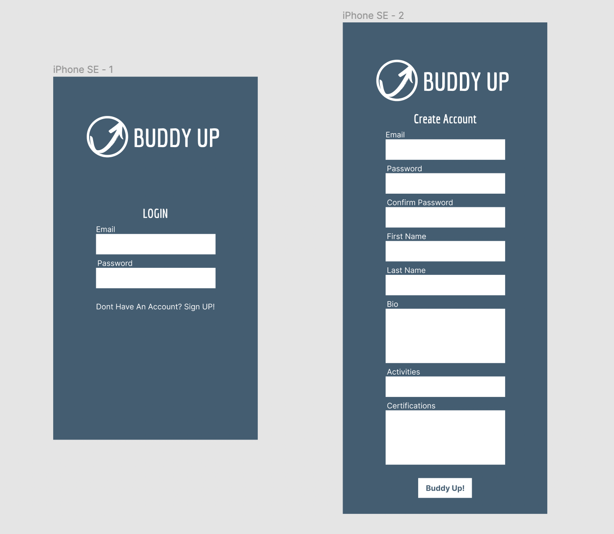
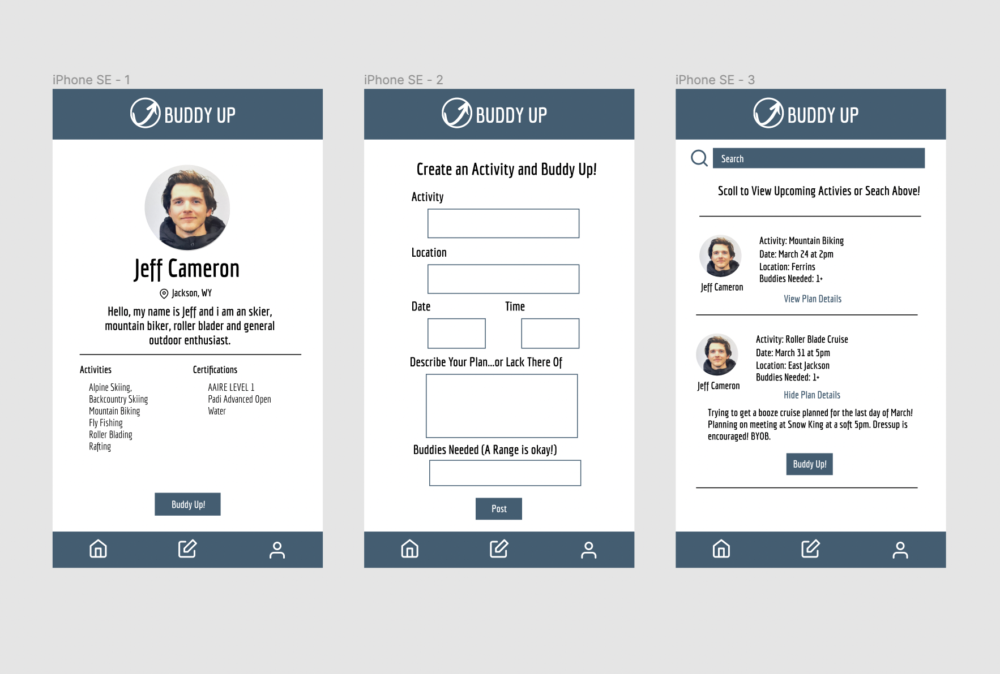

# Buddy Up 
    By Jeff Cameron
    (In Production)

## Description
Designed in Figma. Build Using React. This application is used to connect outdoor athletes with partners in order to facilitate more safe and enjoyable adventures.

### Application Link
Coming Soon

## Application Screenshot

## Table of Contents

* [Github](#github)

* [Questions](#questions)

* [License](#license)

### Github
Visit my Github Profile at https://github.com/jeffgcameron

### Questions 
Email me at jeffgcameron@gmail.com

## License
This application is covered under the MIT license.